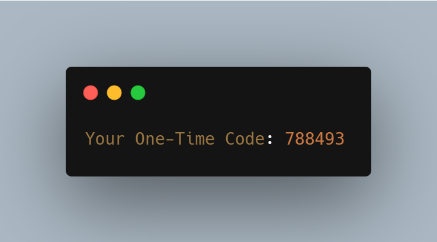

<div align="center">

# OTP Generator

A Java application that generates a secure **6-digit One-Time Password (OTP)** using Java's built-in `SecureRandom` class.


</div>

---

## Features

- Generates a random 6-digit OTP
- Uses `SecureRandom` for cryptographically secure randomness
- Guarantees exactly six digits
- Lightweight console application
- Beginner-friendly Java project

---

## How It Works

The program creates a random number between **100000** and **999999**, ensuring every generated OTP contains exactly six digits.

```java
int otp = 100000 + new SecureRandom().nextInt(900000);
```

---

## Example Output

<p align="center">
  
</p>

---

## Run the Project

Compile:

```bash
javac OtpGen.java
```

Run:

```bash
java OtpGen
```

---
